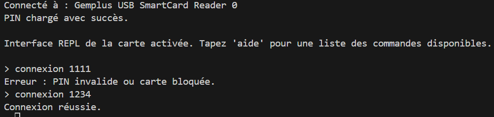
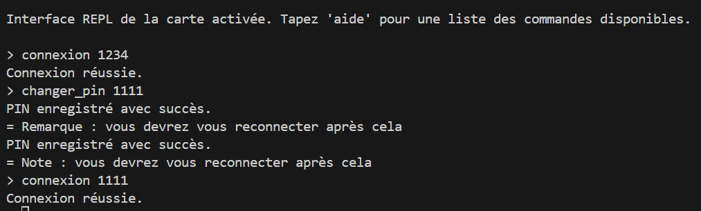
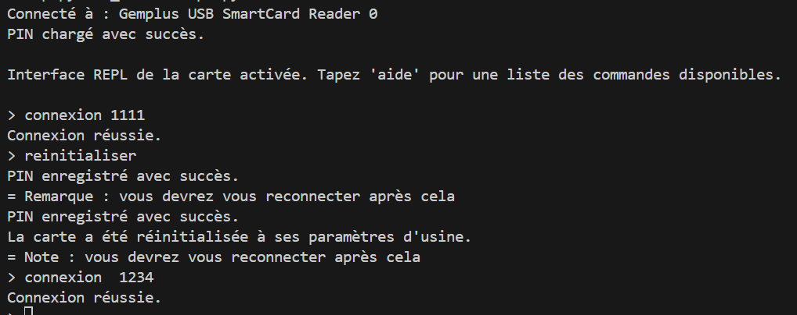
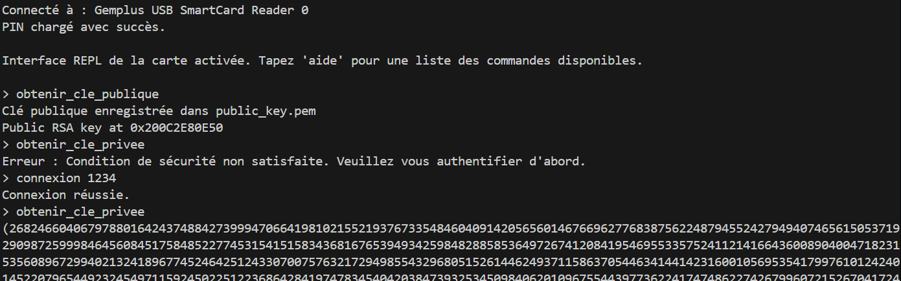
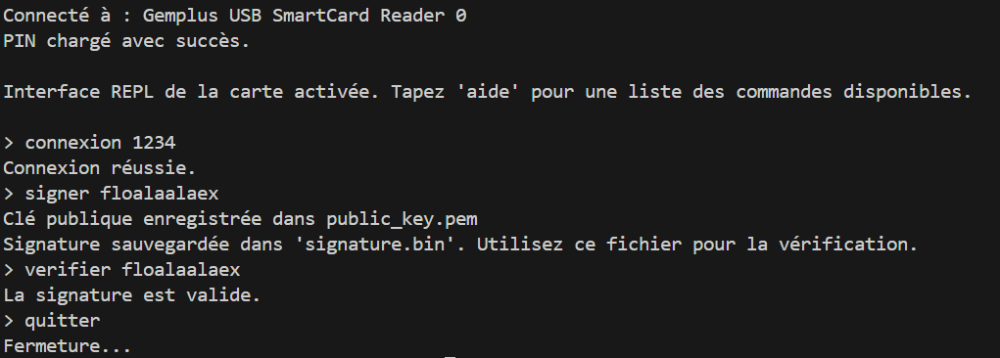
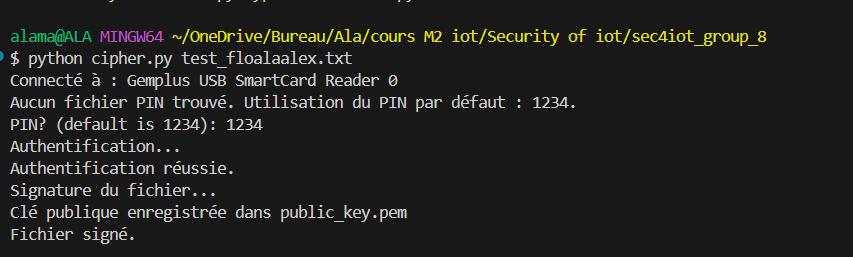
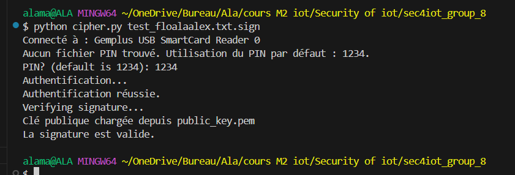

# Application Client Python pour Carte à Puce

Ce projet est une application client Python permettant de communiquer avec une carte à puce via un lecteur compatible. Elle offre des fonctionnalités comme l'authentification avec PIN, la gestion des clés RSA, la signature et la vérification de données.

## Fonctionnalités
- Connexion avec un PIN.
- Modification du PIN.
- Réinitialisation de la carte à ses paramètres d'usine.
- Récupération et gestion des clés RSA.
- Signature de données ou de fichiers.
- Vérification des signatures.

---

## Description avec captures d'écran

### 1. Connexion avec PIN



- Le lecteur de carte détecte et connecte la carte à puce.
- Une tentative de connexion avec un mauvais PIN (`1111`) échoue avec le message : "PIN invalide ou carte bloquée."
- Une nouvelle tentative avec le bon PIN (`1234`) est réussie.

---

### 2. Changement de PIN



- Authentification réussie avec le PIN actuel (`1234`).
- Commande `changer_pin` utilisée pour modifier le PIN à `1111`.
- Une reconnexion avec le nouveau PIN (`1111`) est effectuée avec succès.

---

### 3. Réinitialisation de la carte



- Authentification réussie avec le PIN actuel (`1111`).
- La commande `reinitialiser` est exécutée, réinitialisant la carte à ses paramètres d'usine.
- Le PIN revient à la valeur par défaut (`1234`), et une connexion avec ce PIN est réussie.

---

### 4. Gestion des clés RSA



- Commande `obtenir_cle_publique` : Récupère et enregistre la clé publique dans `public_key.pem`.
- Une tentative d'accès à la clé privée sans authentification échoue.
- Après authentification, la clé privée est récupérée avec succès.

---

### 5. Signature et vérification des données



- La commande `signer` est utilisée pour signer des données (`floalaalaex`).
- La signature est sauvegardée dans `signature.bin` et vérifiée avec succès grâce à la commande `verifier`.

---

### 6. Signature d'un fichier



- La commande `python cipher.py test_floalaalaex.txt` est utilisée pour signer un fichier.
- Le fichier est signé avec succès, et la clé publique est enregistrée.

---

### 7. Vérification de la signature d'un fichier



- La commande `python cipher.py test_floalaalaex.txt.sign` est utilisée pour vérifier un fichier signé.
- La signature est vérifiée avec succès, confirmant que les données n'ont pas été modifiées.

---

## Prérequis

- **Python** : Version 3.6 ou ultérieure.
- **Bibliothèques Python nécessaires** :
  ```bash
  pip install pyscard pycryptodome colorama
